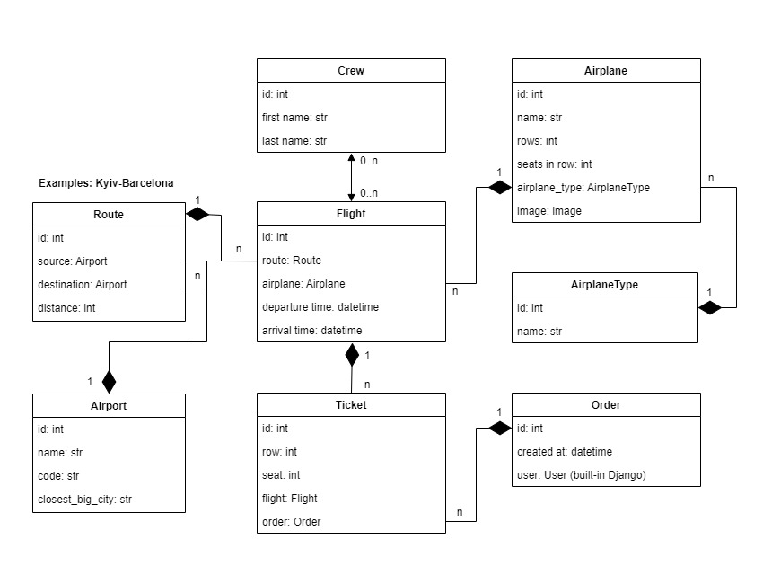
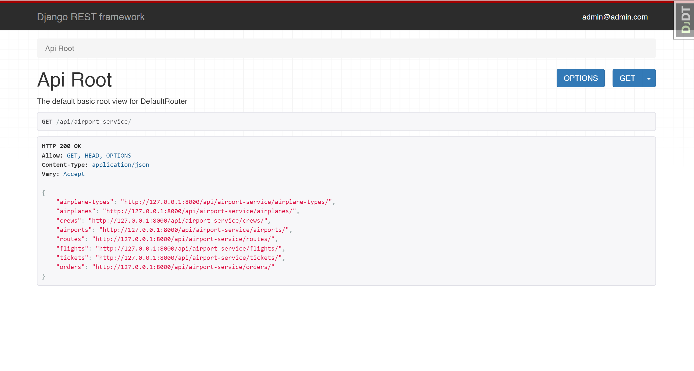

# Airport Service API

API service for system for tracking flights from airports across the whole globe written on DRF.

## Installing using GitHub:

Install PostgresSQL and create db
```
git clone https://github.com/MKeSiMu/airport-service-api
python -m venv venv
source venv/bin/activate
pip install -r requirements.txt
set POSTGRES_HOST=<your db hostname>
set POSTGRES_DB=<your db name>
set POSTGRES_USER=<your db username>
set POSTGRES_PASSWORD=<your db user password>
set SECRET_KEY=<your secret key>
python manage.py migrate
python manage.pyrunserver
```
## Run with docker:

```
docker-compose build
docker-compose up
```

## Getting access:

- create user via /api/user/register
- get access token via /api/user/token

## Installing using GitHub:

## Features:

- JWT authenticated
- Admin panel /admin/
- Documentation is located at /api/doc/swagger
- Managing orders and tickets
- Creating airplanes with airplane type
- Creating airports
- Adding flights
- Filtering airplanes and flights

## Project Diagram



## Demo


